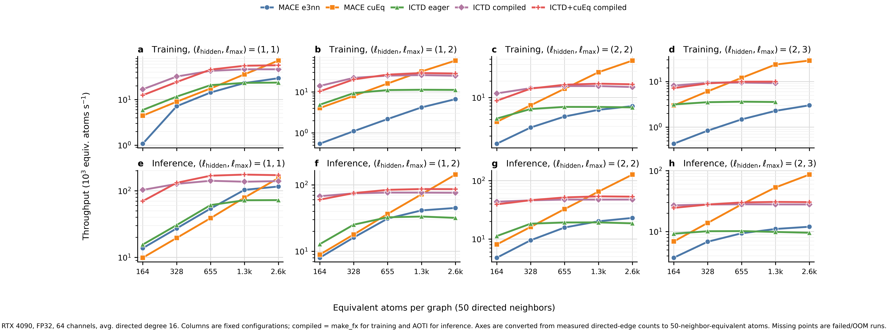
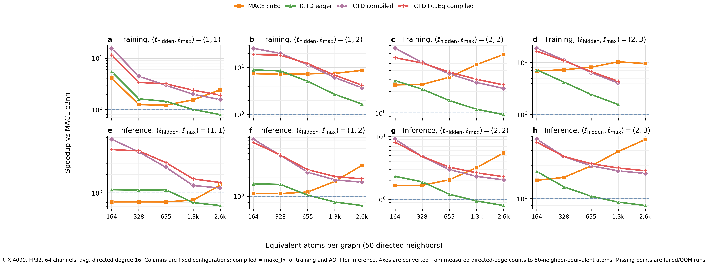

# MACE-ICTD

[](https://doi.org/10.5281/zenodo.20690950)

**MACE in the Irreducible Cartesian Tensor Decomposition (ICTD) basis** — a self-contained
extraction from FSCETP of the ICTD-basis MACE model together with its full training and
deployment stack:

Full bilingual manual:

- English: [`docs/USER_MANUAL.md`](docs/USER_MANUAL.md)
- 中文：[`docs/USER_MANUAL.zh-CN.md`](docs/USER_MANUAL.zh-CN.md)

- **Model** — `PureCartesianICTDFix`, MACE expressed in an *irreducible Cartesian* basis. The
  Clebsch–Gordan couplings are precomputed into dense `U` projection matrices, so features are
  stored as `(channels, 2l+1)` blocks (polynomial `(L+1)²` scaling, dense / cuBLAS-friendly).
- **AOTInductor export** — one N-dynamic `.pt2` for *any* atom count (forces traced in-graph),
  loadable from C++ or Python.
- **Training** — a from-H5 energy + force (+ optional stress/virial) trainer
  (`mace_ictd.cli.train` / `ForceTrainer`): per-atom `SmoothL1` energy + `SmoothL1` force loss
  (`+ c·σ` stress via `--stress-weight`), optimizer + LR schedule, and checkpoints that reload
  bit-for-bit through the deploy path. The 2nd-order-backward force step (and the strain
  derivative for stress) can be flattened via `make_fx` and Inductor-compiled
  (`--train-makefx-compile`), with **size-bucketing** (`--makefx-buckets K`) so variable-size data
  costs one compile per bucket, not one per shape.
- **LAMMPS interface** — the `pair_mff_torch` pair style (C++), the model engine, the
  reciprocal / tree-FMM long-range solvers, and the Python-side export / MLIAP helpers.
- **Long-range module** — reciprocal-space (Ewald-style) *scalar* long-range corrections
  (`reciprocal-spectral-v1`, off / zero-initialized by default). The legacy real-space modes and
  the multipole (dipole/quadrupole) path were removed in this baseline-only build: multipoles need
  l≥1 final-layer features, which the baseline (last layer → l=0, MACE-style) does not carry.

This package is **independent of FSCETP**: it carries every dependency it needs and its imports
are rooted at `mace_ictd`.

---

## Layout

```
MACE-ICTD/
├── mace_ictd/                       # the standalone Python package
│   ├── models/                      # ICTD model, layers, irreps, U-matrix cache, long_range, radial, mlp, zbl, ...
│   │   └── _ictd_cache/v1/          # precomputed CG / U tensors (cg/, cg_full/, u_so3/)
│   ├── cli/                         # export_aoti_core, export_libtorch_core, lammps_interface, ...
│   ├── training/makefx_compile.py   # make_fx 2nd-order-backward train-step compiler
│   ├── interfaces/                  # lammps_mliap, lammps_potential
│   ├── evaluation/calculator.py     # ASE Calculator (MyE3NNCalculator)
│   ├── utils/                       # config, graph_utils, scatter (torch_scatter fallback), checkpoint_metadata, ...
│   ├── synthetic.py                 # build_model / make_fixed_graph helpers (synthetic ICTD models)
│   └── csrc/                        # optional compiled ICTD tensor-product extension
├── lammps_user_mfftorch/            # the LAMMPS USER-MFFTORCH package (C++ pair style, engine, solvers, cmake)
├── setup.py / pyproject.toml
```

## Install

```bash
cd MACE-ICTD
pip install -e .                 # core: torch, numpy, e3nn, ase, opt-einsum-fx
# optional accelerators / features:
pip install -e ".[pyg]"          # torch-scatter / torch-cluster (pure-PyTorch fallbacks exist)
pip install -e ".[cue]"          # cuEquivariance backend
pip install -e ".[e0]"           # pandas, only to read a fitted_E0.csv table
```

Requires **torch ≥ 2.4** (AOTInductor `aoti_compile_and_package`); **torch ≥ 2.7 recommended**
for the make_fx / AOTI deploy paths. `e3nn` is pinned `<0.6` for mace-torch compatibility.

## Quickstart

### Build a model + energy/forces

```python
import torch
from mace_ictd.synthetic import build_model, make_fixed_graph, compute_energy_forces

model = build_model(channels=64, lmax=2, num_interaction=2, route="baseline",
                    product_backend="ictd-bridge-u", dtype=torch.float64,
                    device=torch.device("cpu"), correlation=2)
graph = make_fixed_graph(num_nodes=128, avg_degree=24, dtype=torch.float64, device="cpu")
energy, forces, e_atom = compute_energy_forces(model, graph, create_graph=False)
```

The forward signature is `model(pos, A, batch, edge_src, edge_dst, edge_shifts, cell)` where `A`
is **atomic numbers** (e.g. `[1, 8]`, not species indices) and it returns per-atom energies.

### Run MD through ASE

```python
from mace_ictd.evaluation.calculator import MyE3NNCalculator
atoms.calc = MyE3NNCalculator(checkpoint="model.pt", device="cuda")
```

### Train a model from H5

```bash
# DATA holds processed_train.h5 and optionally processed_val.h5.
python -m mace_ictd.cli.train \
    --data-dir DATA \
    --channels 64 --lmax 2 --num-interaction 2 \
    --epochs 50 --batch-size 4 --lr-scheduler plateau --min-lr 1e-6 \
    --swa --start-swa 38 --swa-lr 1e-4 \
    --swa-energy-weight 1000 --swa-force-weight 100 --swa-stress-weight 0 \
    --device cuda --dtype float64 \
    --train-makefx-compile --makefx-buckets 6 \
    --checkpoint model.pth
```

Loss is per-atom `SmoothL1` energy + `SmoothL1` force, with an optional `SmoothL1` stress/virial
term, `total = a·E + b·F (+ c·σ)` (`--energy-weight` / `--force-weight` / `--stress-weight`, the last
default 0 = off); stress is `σ = dE/dε / V` via the strain derivative. The per-type E0 offset is
re-added from `--atomic-energy-keys/-values` (default H/C/N/O) and `avg_num_neighbors` is
auto-computed from the training H5. Training also uses MACE-style per-atom interaction
ScaleShift by default (`--scaling rms_forces_scaling`, with `--atomic-inter-scale/--atomic-inter-shift`
overrides; use `--scaling no_scaling` for the old identity behavior). All of these values are written
into the checkpoint, so the saved `.pth` rebuilds bit-for-bit via `LAMMPS_MLIAP_MFF.from_checkpoint` and
drops straight into the AOTI / LAMMPS export above. The trainer also supports mace-torch-style
Stage Two/SWA (`--swa`): the loss weights switch at `--start-swa`, the LR moves to `--swa-lr`,
and SWA averaged weights are saved for deployment. LR schedules include `plateau`, `exp`, and
`cosine`, with LR clamped to `[--min-lr, --lr]`. Drop `--makefx-buckets` for global-pad make_fx,
or `--train-makefx-compile` too for plain eager training. The input H5 is produced by
`mace_ictd.data.preprocessing.save_to_h5_parallel` (xyz → `processed_<split>.h5` + a `.counts.npz`
bucket sidecar). Programmatic API: `from mace_ictd.training import ForceTrainer`.

Optional scalar reciprocal long-range correction (off by default):

```bash
python -m mace_ictd.cli.train \
    --data-dir DATA \
    --channels 64 --lmax 2 --num-interaction 2 \
    --long-range-mode reciprocal-spectral-v1 \
    --long-range-boundary periodic \
    --long-range-reciprocal-backend direct_kspace \
    --long-range-kmax 4 \
    --long-range-source-channels 1 \
    --checkpoint model_lr.pth
```

`reciprocal-spectral-v1` learns latent scalar sources from the final invariant descriptor and adds a
reciprocal-space energy term. It is zero-initialized so enabling it starts near the short-range model.
For larger periodic/slab systems, use `--long-range-reciprocal-backend mesh_fft` with
`--long-range-mesh-size N` (`--long-range-boundary slab` also requires `mesh_fft`). This is a learned
long-range correction trained from the same energy/force/stress losses, not an analytic fixed-charge
Ewald term. Native MACE conversion preserves the source model; it does not add long-range terms to an
already trained MACE checkpoint.

Smoke test (CPU always; adds the make_fx + bucketing GPU checks when CUDA is present):

```bash
python -m mace_ictd.test.test_training_smoke
```

### make_fx train-step compile (low-level primitive)

```python
from mace_ictd.training import trace_and_compile_force, make_force_compute_fn
example = (pos.requires_grad_(True), A, batch, edge_src, edge_dst, edge_shifts, cell)
compiled = trace_and_compile_force(model, example, training=True)   # second-order via flat backward
energy_atom, forces = compiled(*example)
```

### AOTInductor export (one `.pt2`, any atom count)

```bash
# from a trained checkpoint:
mff-export-aoti --checkpoint model.pt --out model.pt2 --dynamic
# synthetic (no checkpoint, for testing/benchmarking):
mff-export-aoti --route baseline --channels 64 --lmax 2 --num-interaction 2 --out synth.pt2 --dynamic
mff-export-aoti --help
```

### Convert a native `mace-torch` model

```bash
# 1) Convert the torch-saved native mace-torch model.
# The input is a torch.save(model) ScaleShiftMACE object, not a raw state_dict.
python -m mace_ictd.cli.convert_mace \
    --mace-model mace.model \
    --out mace_ictd.pth \
    --product-backend ictd-bridge-u \
    --dtype float64 \
    --device cpu

# 2) Conservative deployment export: bridge-U, with E0 embedded into the .pt2.
mff-export-aoti --checkpoint mace_ictd.pth --elements H,C,N,O --out mace_ictd.pt2 --dynamic --embed-e0

# 3) Performance export: replace products with cuEq and fold to the e3nn convention.
# This path requires cuEquivariance custom ops at load time. Keep E0 outside this core
# if your exporter/runtime cannot combine --embed-e0 with --cueq-product.
mff-export-aoti \
    --checkpoint mace_ictd.pth \
    --elements H,C,N,O \
    --out mace_ictd_cueq_e3nn.pt2 \
    --dynamic \
    --cueq-product \
    --angular-basis e3nn
```

The converter loads a torch-saved `mace-torch` `ScaleShiftMACE`, copies weights into
`PureCartesianICTDFix`, and writes a MACE-ICTD checkpoint that `LAMMPS_MLIAP_MFF.from_checkpoint`
and `mff-export-aoti` can load directly. It is validated against the `mace-torch`
`ScaleShiftMACE` layout used in this repository's tests and benchmarks (`mace==0.3.16`,
`e3nn<0.6`). Newer `mace-torch` releases may work if the saved object layout and
`extract_config_mace_model` output remain compatible, but they are not automatically covered by this
statement. Because MACE checkpoints are Python pickles, very old pretrained models may need the
matching historical `mace-torch`/`e3nn` environment just to load before conversion.

Current exact-conversion support is intentionally narrow and structure-based: `ScaleShiftMACE`,
`num_interactions >= 2`, bessel radial basis, `radial_MLP=[64,64,64]`, MACE parity hidden irreps with
uniform channels and contiguous `l=0..L`, uniform correlation across layers, no pair repulsion /
distance transform, SiLU scalar readout with `MLP_irreps=16x0e`, and
`max_ell >= hidden_irreps.lmax`. The converter reads the original `use_reduced_cg` flag and rebuilds
MACE-ICTD with the same setting. Unsupported variants are rejected rather than silently converted.
From-scratch MACE-ICTD training uses `--lmax` for hidden irreps and optional `--max-ell` for the edge
spherical-harmonics cutoff. Conversion preserves the native MACE architecture; train or fine-tune a
MACE-ICTD checkpoint with `--long-range-mode reciprocal-spectral-v1` if a learned long-range
correction is required.

### LAMMPS

The `lammps_user_mfftorch/` tree is a LAMMPS USER package. Drop `src/USER-MFFTORCH/` into your
LAMMPS `src/`, enable it via the provided `cmake/` files, build LAMMPS against LibTorch, then:

```
pair_style   mff/torch  model.pt2
pair_coeff   * *
```

`pair_mff_torch` loads the AOTI `.pt2` through `mff_torch_engine`; long-range is split into the
reciprocal / tree-FMM solvers. See `lammps_user_mfftorch/README.md`.

## Verification

The extracted, slimmed package was checked on torch 2.5.1 / e3nn 0.5.9 (float64, CPU):

| check | baseline |
|---|---|
| rotation **energy invariance** | `0` |
| rotation **force equivariance** | `1.1e-19` |
| make_fx trace == eager (energy/force) | `0` / `0` |
| baseline output **bit-identical** before/after fusion removal | `dE=0, dF=0` |
| imports + forward with all optional deps absent | PASS |

Numerics and equivariance are preserved bit-for-bit relative to the FSCETP source; removing the
fusion route did **not** perturb the baseline (verified bit-identical against a pre-removal reference).

## Backend Throughput Benchmark

Controlled fixed-edge throughput benchmark on an RTX 4090, FP32, 64 channels, average directed
degree 16. The x-axis is converted from measured directed-edge counts to
50-directed-neighbor-equivalent atom counts.





The paper benchmark archive is kept under `benchmarks/paper/`. It contains the
operator and whole-model benchmark scripts, selected and raw CSV/JSON/Markdown
results, validation logs, and the PDF/PNG/SVG figures used by the manuscript.

## Relationship to original MACE

The central point of this repository is the ICTD basis construction and its deployment path:
fixed `Q`/`U` operators re-express MACE/e3nn angular algebra in irreducible Cartesian tensor blocks
while preserving the original MACE interaction/readout semantics. The practical target is not a new
chemical model family, but a numerically matched MACE representation that is dense-kernel friendly,
convertible from native `mace-torch`, and exportable to AOTI/LAMMPS.

The baseline `PureCartesianICTDFix` is **MACE in an irreducible Cartesian tensor basis**. Headline
checks vs original `mace-torch` are covered by the converter and angular-basis regression tests:

| component | MACE ↔ ICTD-MACE agreement |
|---|---|
| radial (Bessel × polynomial cutoff) | identical (`3e-16`) |
| angular basis (SH ↔ ICTD harmonics) | exact orthogonal change of basis `Q` (`~1e-15`) |
| symmetric contraction (product basis) | native MACE conversion parity is tested through `mace_ictd/test/test_mace_converter.py`; `native-mace` backend *is* MACE's `MaceSymmetricContraction` |

i.e. any accuracy gap to a reference MACE is a training/framework matter, not architecture.

To express any **equivariant** feature in the original-MACE/e3nn basis, multiply by the fixed
orthogonal `Q`: `mace_ictd.mace_basis.to_mace_basis(x, lmax)` (or `model.to_mace_basis(x)`), with
the matching C++ constants/helper in `lammps_user_mfftorch/.../mff_mace_basis.h`. Energy, forces and
the virial are basis-invariant, so this is a no-op for them — it only re-expresses `l≥1` features.

## Notes / caveats

- **Optional backends are guarded.** `torch_scatter`, `torch_cluster`, `cuequivariance`, and
  `triton` are all optional; the package imports and runs without them (pure-PyTorch fallbacks).
- **Checkpoint class paths.** Architectures are rebuilt from a config + `state_dict`, so renaming
  the package to `mace_ictd` does not affect normal checkpoint loading. If you have an old
  checkpoint that pickled whole `nn.Module` objects under `molecular_force_field.*`, add a
  `torch.serialization` safe-globals / module alias shim when loading.
- This is a **copy** extracted from FSCETP; the FSCETP source was not modified.
